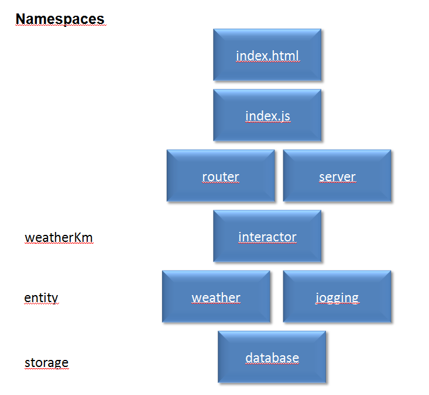

# mashup-Pia
A Node.js back-end that mashes up information for a JavaScript front-end

# Tietolähteet #

Tämä mashup käyttää lähteenä:
* Ilmatieteen laitoksen säädataa
* Lenkkeilytietoa

Tietoja yhdistetään backendissä ja visualisoidaan front-endissä.

# Toiminnallisuuskandidaatteja #

* Sää vs. kilometrit visualisointi
* Lenkin lisääminen
*        = Minimum viable product
* Kuvien lisäys sää vs. kilometrien visualisointiin
* FE tarkenna - painike
* Laji - sää - kilometrit -visualisointi
* Visualisointi vuosittain (esim. sää vs. kilometrit)

# weatherKm rakenne #

